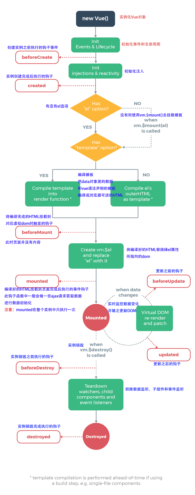

## 介绍

一个组件从开始到最后消亡所经历的各种状态，就是一个组件的生命周期

从组件被创建，到组件挂载到页面上运行，再到页面关闭组件被卸载，这三个阶段总是伴随着组件各种各样的事件，这些事件，统称为组件的生命周期函数！

Vue在执行过程中会自动调用生命周期钩子函数，我们只需要提供这些钩子函数即可，钩子函数的名称都是Vue中规定好的！

## 示意图

## 钩子函数

> `beforeCreate()`
- 在实例初始化之后，数据观测 (data observer) 和 event/watcher 事件配置之前被调用，此时，无法获取 data中的数据、methods中的方法

> `created()`
- 这是一个常用的生命周期，可以调用methods中的方法、改变data中的数据, 发送请求获取数据

> `beforeMounted()`
- 在挂载开始之前被调用

> `mounted()`
- 此时，vue实例已经挂载到页面中，可以获取到el中的DOM元素，进行DOM操作

> `beforeUpdated()`
- 数据更新时调用，发生在虚拟 DOM 重新渲染和打补丁之前。可以在这个钩子中进一步地更改状态，这不会触发附加的重渲染过程。 此处获取的数据是更新后的数据，但是获取页面中的DOM元素是更新之前的

> `updated()`
- 组件 DOM 已经更新，现在可以执行依赖于 DOM 的操作。

> `beforeDestroy()`
- 实例销毁之前调用。在这一步，实例仍然完全可用。 实例销毁之前，执行清理任务，比如：清除定时器等

> `destroyed()`
- Vue 实例销毁后调用。调用后，Vue 实例指示的所有东西都会解绑定，所有的事件监听器会被移除，所有的子实例也会被销毁。

<template>
  <TitleMenu></TitleMenu>
</template>